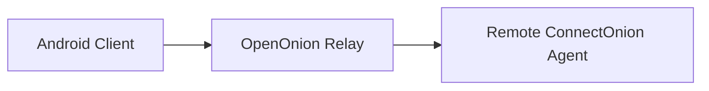

# ConnectOnion Android Agent Chat

> 一个通过 OpenOnion Relay 连接远程 ConnectOnion Agent 的原生 Android 聊天客户端。

## 项目简介

本项目是 **UNSW COMP9900 Capstone 团队项目**。应用面向已经持有 ConnectOnion 地址的用户，提供 Agent 管理、多 Session 对话、Streaming Response、历史记录恢复和 Agent 交互流程。

应用不提供公开 Agent 发现服务，也不运行自建业务后端。主要通信链路如下：

> 本仓库仅用于个人 Portfolio，展示项目背景、系统架构、主要功能、个人贡献和测试方式。原始实现位于团队 Private Repository，本仓库不包含私有项目源代码。

## 我的个人贡献

这是团队共同完成的项目。我的主要工作集中在以下部分：

- **Agent 管理：**参与 Agent 管理功能开发，实现和完善 Agent 编辑功能，并优化相关 UI 与交互流程。
- **Session 管理与切换：**参与 Session 管理功能开发，实现不同 Session 之间的切换，在切换过程中维护正确的会话上下文和界面状态，并完善相关交互体验。
- **Stop Generation（US-25）：**负责停止 Agent 生成能力。在 Agent 工作或 Streaming 输出期间，将发送操作切换为停止操作；用户触发后，通过当前 WebSocket 连接发送 `{"type":"INTERRUPT"}`，中断当前生成任务但保持连接。中断完成后结束 Loading 状态，并恢复输入框和发送能力。该功能涉及 WebSocket、Streaming Response、Interrupt Handling 和 UI State Management。
- **Bug 修复与功能完善：**参与 Agent、Session 和聊天交互流程中的问题定位与修复，完善已有功能的 UI 状态和交互逻辑，并配合团队进行功能集成与测试。

更完整的职责说明见 [docs/my-contributions.md](docs/my-contributions.md)。

## 核心功能

- 通过 ConnectOnion 地址添加、编辑和管理 Agent
- 连接远程 Agent，发送消息并接收 Streaming Response
- 创建、切换、重命名、删除和恢复聊天 Session
- 在多个 Session 之间隔离会话上下文与 Streaming 状态
- 停止正在进行的 Agent 生成，同时保持 WebSocket 连接
- 在支持的情况下获取 Agent 信息并使用 Skills / Slash Commands
- 支持文件附件、语音输入以及 Approval / Ask User 等交互流程
- 对删除等破坏性操作提供确认与取消流程
- 在本地持久化相关 Agent、Session、消息及应用偏好数据

功能详情见 [docs/features.md](docs/features.md)。

## 技术栈

- Kotlin、Java 17
- Native Android，min SDK 26 / target SDK 35
- Jetpack Compose、Material 3
- Android Lifecycle、ViewModel
- Kotlin Coroutines、StateFlow、SharedFlow
- OkHttp、WebSocket
- Room、DataStore
- AndroidX Security Crypto、Bouncy Castle
- Gradle Kotlin DSL
- JUnit、MockK、Turbine、Robolectric、MockWebServer、Espresso、Compose UI Test、Kover

## 系统架构

项目采用单 `:app` Module 的分层设计：

- **UI：**Compose 页面、组件、ViewModel 和界面状态
- **Domain：**领域模型、Repository 接口和 Use Case
- **Data：**Repository 实现、本地持久化、偏好设置、附件和身份数据处理
- **Network：**WebSocket 连接、Session 级连接管理、远程信息获取和通信事件处理

每个聊天 Session 维护独立的连接上下文，Streaming 事件按 Session 路由，避免不同会话之间出现消息串流。详细设计见 [docs/architecture.md](docs/architecture.md)。

## 项目截图

以下路径为截图占位。发布前应添加仅包含虚构 Agent、演示对话和非敏感地址的截图。

| Agent 管理 | 聊天 Session | Session 管理 |
| --- | --- | --- |
|  |  |  |

截图要求见 [screenshots/README.md](screenshots/README.md)。

## 测试与评估

项目采用自动化测试与结构化人工验证相结合的方式：

- Unit Test、ViewModel 和 Coroutine / Flow 测试
- 使用 MockWebServer 和测试替身隔离网络边界
- Room 数据持久化与 Migration 测试
- Robolectric、Espresso 和 Compose UI Test
- Agent、Session、Streaming、Interrupt、附件和错误状态的人工流程验证
- 团队 Peer Review，以及 Tutor / Client 演示

本 Portfolio 不使用未经验证的用户研究数据或性能指标。测试范围见 [docs/testing.md](docs/testing.md)。

## 技术难点与收获

- 管理连接、Streaming、Interrupt 和交互式请求等多种异步状态
- 在 Session 切换时隔离会话上下文，同时保持后台任务状态一致
- 在不中断 WebSocket 的前提下停止当前 Agent 生成并恢复可交互 UI
- 区分瞬时 UI 状态与需要持久化的本地数据
- 处理网络失败、延迟事件、取消操作和破坏性操作确认
- 在团队协作中完成需求开发、问题定位、功能集成和测试

## 项目性质与隐私说明

- 本项目由 UNSW COMP9900 Capstone 团队共同完成，并非个人独立项目。
- 原始源代码位于 Private Repository，不通过本仓库公开或分发。
- 本公开仓库只包含 Portfolio 文档和经过脱敏的项目截图，不是源代码镜像，也不是可安装版本或公开 SDK。
- 本仓库不应包含 Token、API Key、密码、内部 URL、真实 Agent 地址、学生数据、其他成员个人信息、私有 Issue 或课程机密材料。

