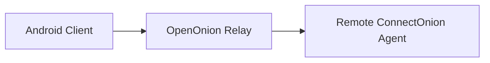
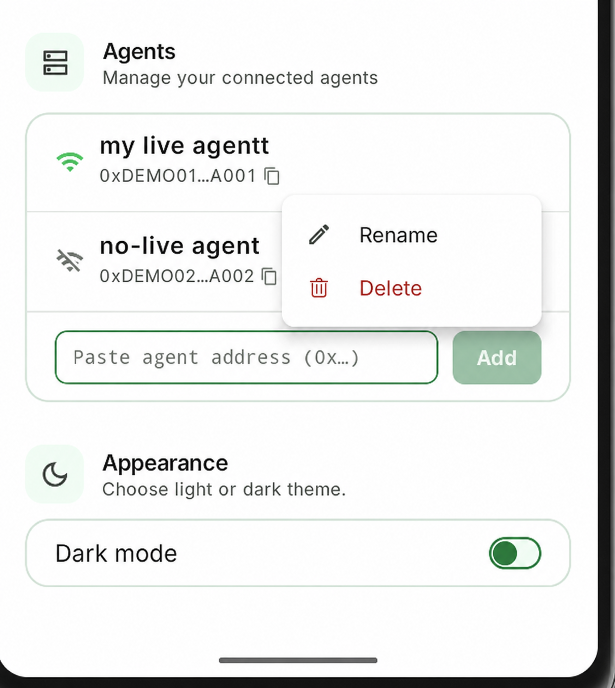
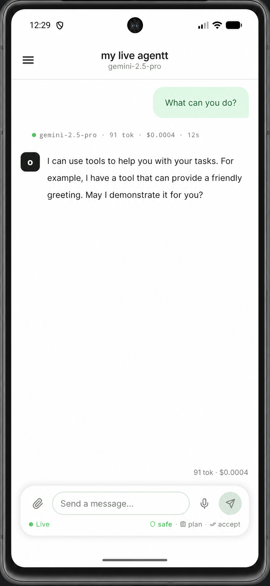
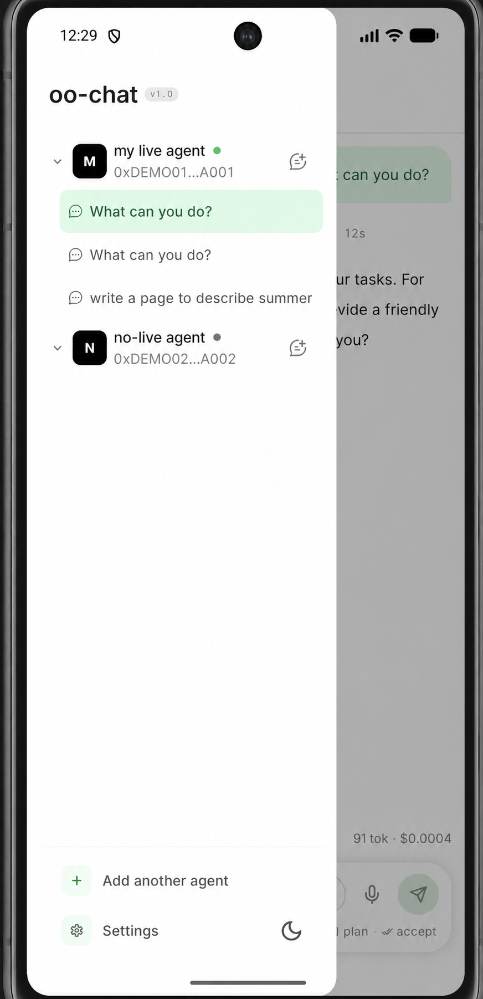

# ConnectOnion Android Agent Chat

> A native Android client for managing and chatting with remote ConnectOnion agents through an OpenOnion relay.

## Recruiter summary

This repository presents an Android team project completed for UNSW COMP9900 Capstone. The application supports agent management, parallel multi-session chat, streamed responses, interactive agent workflows, and local conversation history. This public repository is a documentation-only portfolio showcase; the implementation remains in a private university team repository.

## Project overview

ConnectOnion Android Agent Chat provides a mobile interface for communicating with remote ConnectOnion agents. Users add an agent by its ConnectOnion address, connect through an OpenOnion relay, and organise conversations into reusable chat sessions.

The app does not provide public agent discovery and does not operate a custom application backend. It acts as a client in the following communication path:

## Key features

- Add and manage agents by ConnectOnion address
- Connect to remote agents and exchange chat messages
- Receive streamed replies and stop an in-progress response
- Create, switch between, and reopen chat sessions
- Rename and delete agents and sessions
- Confirm or cancel destructive actions
- Retrieve agent information where supported
- Use agent-provided skills and slash commands where available
- Send supported file attachments and compose messages by voice
- Respond to approval, clarification, and review prompts from an agent
- Persist relevant local app and session data

See [docs/features.md](docs/features.md) for the feature breakdown.

## Architecture

The single-module Android application follows a layered design: Compose UI, domain models and interfaces, data/persistence adapters, and network communication. Session-scoped connections allow work in one conversation to continue while the user views another. Requests travel from the Android app through an OpenOnion relay to the selected remote ConnectOnion agent; no project-owned backend sits in that path.

See [docs/architecture.md](docs/architecture.md) for responsibilities, boundaries, and data flow.

## Tech stack

- Kotlin and Java 17 toolchain
- Native Android (minimum SDK 26; target SDK 35 in the private implementation)
- Jetpack Compose and Material 3
- Android lifecycle and ViewModel components
- Kotlin coroutines
- StateFlow and SharedFlow
- OkHttp
- Room and DataStore
- AndroidX Security Crypto and Bouncy Castle
- Gradle and Kotlin DSL

## Screenshots

The images below are placeholders. Before publishing, add sanitised screenshots that contain only demo agents, fictional conversations, and non-sensitive addresses.

| Agent management | Chat session | Session management |
| --- | --- | --- |
|  |  |  |

See [screenshots/README.md](screenshots/README.md) for the capture checklist.

## My contributions

This was a team capstone project. My individual contribution summary is intentionally editable until responsibilities are verified against project records:

- `[Add your specific feature here]`
- `[Describe your implementation responsibility here]`
- `[Add a testing, design, or collaboration contribution here]`

See [docs/my-contributions.md](docs/my-contributions.md) before publishing or linking this repository from a resume.

## Testing and evaluation

The project used a practical mix of automated testing and structured human evaluation. Depending on the component, this included unit tests, coroutine and state-flow tests, network tests with controlled responses, Android/UI tests, structured manual workflow checks, peer review, and tutor/client demonstrations.

No user-study statistics or performance claims are presented here. See [docs/testing.md](docs/testing.md) for the scope and suggested evidence to add.

## Challenges and lessons learned

- Modelling streamed connection, messaging, and interactive approval states clearly for a responsive mobile UI
- Keeping multiple agents and parallel chat sessions isolated, understandable, and recoverable
- Handling network failures, cancellation, and destructive actions without surprising the user
- Choosing appropriate boundaries between transient UI state and persisted local data
- Safely handling identity material, signed communication, and user-selected attachments
- Coordinating feature ownership and integration in a university team environment
- Documenting a technical project publicly without exposing private source or operational details

## Privacy and source-code notice

This repository contains portfolio documentation and approved, sanitised screenshots only. It intentionally excludes source code, build artefacts, credentials, API keys, secrets, internal URLs, real agent addresses, student data, private issue history, and confidential project material.

The full implementation repository is private because the application was developed as a UNSW COMP9900 university team project. Access to that repository cannot be provided through this showcase. The material here describes the project at a high level and is not a source-code mirror.

## Repository status

Portfolio showcase only. It is not an installable release, public SDK, or open-source distribution of the original application.
