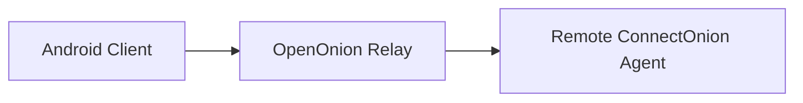
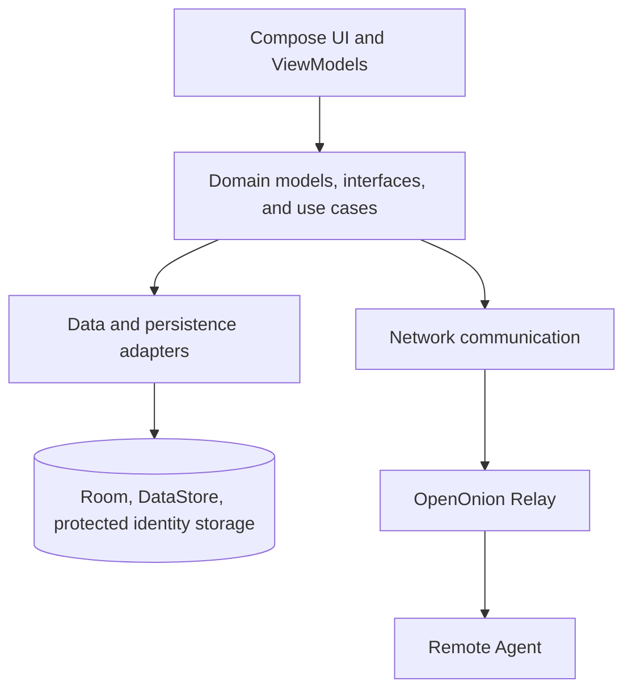

# Architecture

## System context

The Android application is the user-facing client. It sends communication through an OpenOnion relay to a remote ConnectOnion agent. The project does not provide public agent discovery and does not operate a custom backend.

## Client responsibilities

- **UI layer:** Compose screens and ViewModels present agents, sessions, streamed conversations, settings, confirmations, and interactive prompts.
- **Domain layer:** Framework-light models, repository contracts, and use cases define the application behaviour consumed by the UI.
- **Data layer:** Repository implementations coordinate local records, preferences, attachment handling, and identity storage.
- **Network layer:** Session-scoped connections encapsulate relay communication and translate remote events into domain-facing state.
- **Local persistence:** Room retains conversations, DataStore retains lightweight preferences, and sensitive identity material is stored separately using Android security facilities.

This is a conceptual portfolio diagram, not a source-level package map. Internal class names, protocols, endpoints, and security-sensitive implementation details are deliberately omitted.

## Typical data flows

### Add and connect to an agent

1. The user enters a ConnectOnion address.
2. The client validates and stores the relevant agent record.
3. The user selects the agent and initiates a connection.
4. The client communicates through the OpenOnion relay.
5. The UI reflects connection success, progress, or a recoverable error.

### Send a message

1. The user selects an agent and chat session.
2. The client records and displays the outgoing message state.
3. The message is sent through the relay to the remote agent.
4. The reply or failure is mapped back into conversation state.
5. Relevant session history is persisted locally.

### Switch while work is in progress

1. Each active Android chat session owns an independent connection context.
2. Incoming events are associated with their originating session.
3. Switching the visible session does not intentionally terminate work in another session.
4. Returning to a session restores its messages and current working state.

## Design decisions

- **Layered boundaries:** UI code consumes domain contracts instead of parsing transport data directly.
- **Session isolation:** Connection and streaming state are scoped by chat session to prevent cross-talk.
- **Local-first history:** Relevant agents, sessions, and messages survive app restarts without a project-owned backend.
- **Explicit safety states:** Interruptions, approvals, questions, errors, and destructive actions are represented as deliberate user flows.
- **Manual dependency wiring:** App-level construction keeps dependencies visible without introducing a dependency-injection framework.

## Boundaries and privacy

- No project-owned backend is represented in this architecture.
- Agent discovery is out of scope; users supply an address directly.
- Real addresses, internal URLs, credentials, message contents, and protocol-specific secrets must not appear in this public repository.
- Screenshots and diagrams should use fictional data only.
