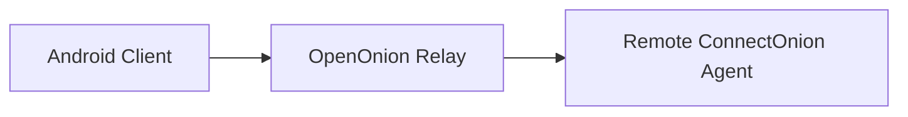
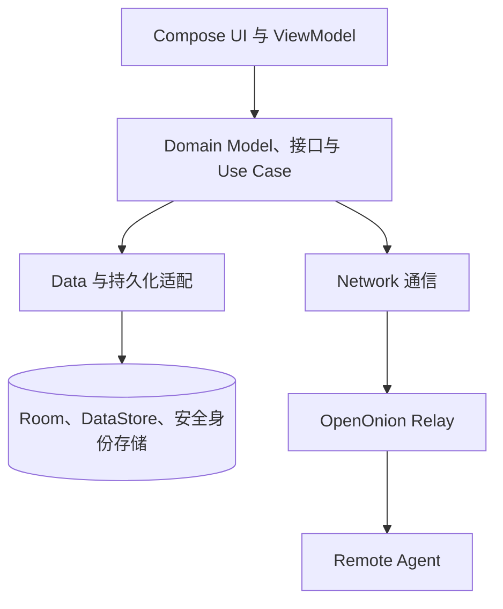

# 系统架构

## 系统上下文

Android Client 是面向用户的客户端，通过 OpenOnion Relay 与远程 ConnectOnion Agent 通信。项目不提供公开 Agent 发现功能，也不运行自建业务后端。

## 客户端分层

- **UI：**使用 Jetpack Compose 展示 Agent、Session、Streaming 对话、设置、确认操作和交互式提示；ViewModel 负责组织页面状态。
- **Domain：**定义领域模型、Repository 接口和 Use Case，作为 UI 与具体实现之间的边界。
- **Data：**协调本地记录、应用偏好、附件读取、身份数据以及 Repository 实现。
- **Network：**封装 WebSocket 和远程信息访问，将通信事件转换为上层可消费的状态。
- **本地持久化：**Room 保存会话与消息，DataStore 保存轻量偏好，敏感身份数据通过 Android 安全能力独立保存。

该图仅描述可公开的概念架构，不对应完整源码目录，也不公开内部端点、协议实现、类名或安全敏感细节。

## 主要数据流

### 添加并连接 Agent

1. 用户输入 ConnectOnion 地址。
2. 客户端验证输入并保存相关 Agent 信息。
3. 用户选择 Agent 并发起连接。
4. 客户端通过 OpenOnion Relay 与远程 Agent 通信。
5. UI 展示连接中、连接成功或可恢复错误状态。

### 发送消息与接收 Streaming Response

1. 用户选择 Agent 和聊天 Session。
2. 客户端记录发送状态，并通过当前 Session 的连接发送消息。
3. 远程 Agent 的 Streaming 事件持续映射到对应 Session。
4. UI 更新工作状态、阶段信息和最终回复。
5. 相关会话历史持久化到本地。

### Session 切换

1. 每个活跃 Session 拥有独立的连接上下文。
2. 收到的事件通过 Session 标识路由到所属会话。
3. 用户切换当前界面时，不主动终止其他 Session 中进行的任务。
4. 返回原 Session 后恢复其消息和当前工作状态。

### Stop Generation

1. Agent 工作或 Streaming 输出期间，UI 将发送操作切换为停止操作。
2. 用户点击停止后，客户端通过当前 WebSocket 连接发送 `{"type":"INTERRUPT"}`。
3. 当前 Agent 生成任务被中断，但 WebSocket 保持连接。
4. 客户端处理 Interrupt 完成及可能延迟到达的事件，结束 Loading 状态。
5. 输入框和发送能力恢复，用户可以继续当前 Session。

## 关键设计考虑

- **分层边界：**UI 通过 Domain 接口访问业务能力，不直接解析传输层数据。
- **Session 隔离：**连接和 Streaming 状态按 Session 管理，避免消息串流。
- **本地历史：**相关 Agent、Session 和消息可在应用重启后恢复。
- **异步状态管理：**连接、Loading、Streaming、Interrupt、Approval 和错误状态均需要明确的 UI 表达。
- **连接连续性：**Stop Generation 中断当前任务而非断开 WebSocket，减少后续交互的额外连接成本。
- **手动依赖组装：**在 Application 层集中创建依赖，保持依赖关系可见。

## 公开边界

- 不公开真实 Agent 地址、内部 URL、凭据、消息内容或协议安全细节。
- 不复制 Private Repository 的源码、测试代码或内部文档。
- 架构图和截图仅使用虚构、脱敏数据。

